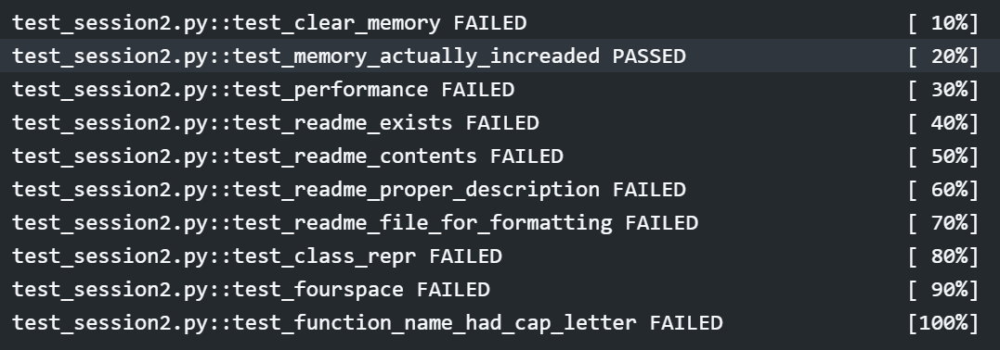

<h1 align="center">Object Mutability and Interning</h1>

<h2 align="center"> Assignment Question </h2>

* Individual Assignment
* Visit this link and accept the assignment (Links to an external site.)
* We are NOT using GitHub Actions this time, but using GitHub Workflow (check python-package.yml file to learn more). This is how you'd be testing your code in production. 
* Deadline is 24th July 11:59 PM. 
* More Commits = Less points. 1st commit is free, post which every addition commit leads to a absolute drop of 10% score (i.e. if you make 21 commits, you'll score negative 1000 points)
* Once done, copy your test results (exactly the content shown below) and paste as text as your assignment submission (your repos will be manually checked as well, and in case of mis-representation you'd get -2000pts))

<h2 align="center"> Assignment Solution </h2>

This is the solution of the assignment regarding Object Mutability and Interning.
There are test cases designed in such a way to enforce python convection on the code. 

Objects used are **classes** and **functions**.

### Classes

#### **Something class**

This class initializes a variable called something_new to None i.e. the variable is pointing at the location of None class object.

#### **SomethingNew class**

This class takes in i and something as a parameter for constructor (function having name __init__ ). If nothing is passed while initilizaing it, it takes the default values as 0 for i and Something object for something.

### **Functions**

#### **add_something**

This function takes in collection and i as parameters. It calls Something class and stores the reference of the object to something variable. something_new variable of Something class is pointed to the object of SomethingNew class taking in i and something as parameter. Hence this is a cyclic refernce as Something class object variable something points to SomethingNew class object and something variable of SomethingNew class points to something which is the object of Something class. Then the object is appended to collection list which stores something object. 

#### **reserved_function**

This function is used for future usage.

#### **clear_memory**

This function clears the memory, As add_something creates cyclic references, therefore gc.collect is expliciteli called to clear them. It is generally in sleep and is triggered every minute automatically.

#### **critical_function**

This function runs from 1 to 131072, every iteration it calls add_something function and passes list and the iteration number as parameter. Once all the iterations are done, it calls clear_memory function to free the memory space.

#### **compare_strings_old**

This function takes in n as a parameter. n is the total iterations the loop in the function will run. The first loop checks if 'a' and 'b' strings are equal or not and the second loop checks n times if character d exists in the list of a which is stored under the variable name of char_list.

#### **compare_strings_new**

This function is a faster implementation of compare_string_old function. Here also it takes n as parameter for the same purpose. But here the strings are interned using sys.intern function and then both the functionilities i.e. checking if both are same and checking for d is done in the same loop to save time. Here set is used instead of char_list, becase sets are approximately 10 times faster than list.

### **Test Cases**
|Sr No.| Test Case| Description| Status |
| --- | --- | --- | -- |
|1| Clear Memory | This test checks to clear all the cyclic references memory from RAM| PASS |
|2 | Memory Acutally Increased| This function checks if the user has cheated in the previous testcase by fooling the test by increasing the memory | PASS |
|3| Test_performance |  This test is conducted to test the performance of | PASS|
| 4 | test_readme_exists| We need to add readme to describe what all is present in the github | PASS|
| 5 | Test_readme_contents | this test is to check the content of the readme. it should minimum have 500 words. | PASS|
|6 |Test_readme_proper_descrition | This is to check whether we have described all the functions and classes properly in the readme| PASS|
| 7| test_readme_file_for_formatting | This is to check whether we have used proper headings or not| PASS|
| 8 |class_repr| This checks wehter we have formatted the class representation or not| PASS|
|9 | Test Fourspace| we are using spaces instead of tabs, hence we need to maintain spaces counter in a multiple of 4 | PASS|
|10|test_function_name_had_cap_letter| According to pep8 guidelines, function names should be in lowercase with underscore as space| PASS|

---
<h3 align = "center"> Made with ❤ & 🍻 by KillerStrike</h3>