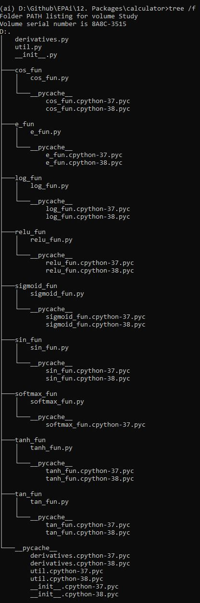

<h1 align="center">Packages</h1>

<h2 align="center"> Assignment Question </h2>

---

1. Build a calculator package that has separate module for:
   1. sin, cos, tan, tanh, softMax, sigmoid, relu log and exp
   2. The modules shall include their derivatives as well
   3. If we do import calculator, we should be able to access all the above function (except deviratives)
   4. For derivates we must do: from package import derivatives. 
   5. Outputs are returned as well as printed using only f-string
   6. Write simple test cases to check the outputs of each operator and their derivative

<h2 align="center"> Assignment Solution </h2>

---

### Approach

Here in this we have to develop a calculator package which can perform operations like sin, cos, tan, tanh, softmax, relu, log and exp and can also give derivatives of those.

#### Tree

  

    
  

This is the module structure which we have followed, There are seperate folders for each function. Each file has 2 functions implemented i.e. the main function and its derivative function.

#### File Description

`init.py`: This file calls all the main funcaitionalities so that when we do `import calculator`, it will automatically import these functions.

`derivative.py`: This file imports all the derivatives of the main functionality, so when we do `from calculator import derivative`, all these derivative functions will be imported.

### Test Cases

Here we have defined test cases to check each functionality i.e. the main one and the derivative one. Then we have checked for proper annotations and doc string in the code. We have also checked for proper readme files.

---
<h3 align = "center"> Made with ❤ & 🍻 by KillerStrike</h3>