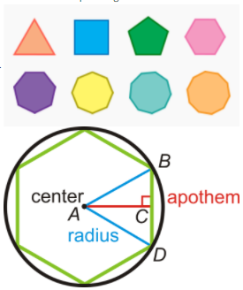

<h1 align="center">Sequence Types I</h1>

<h2 align="center"> Assignment Question </h2>

1. A regular strictly convex polygon is a polygon that has the following characteristics:
   1. all interior angles are less than 180
   2. all sides have equal length
   3. 
2. For a regular strictly convex polygon with:
   1. n edges (=n vertices)
   2. R circumradius
   3. interiorAngle = (n-2)*180/n
   4. edgeLength, s = 2*R*sin(pi/n)
   5. apothem, a= R*cos(pi/n)
   6. area = 1/2*n*s*a
   7. perimeter = n*s
3. Objective 1 [pts:400]:
   1. Create a Polygon Class:
      1. where initializer takes in:
         1. number of edges/vertices
         2. circumradius
      2. that can provide these properties:
         1. edges
         2. vertices
         3. interior angle
         4. edge length
         5. apothem
         6. area
         7. perimeter
      3. that has these functionalities:
         1. a proper __repr__ function
         2. implements equality (==) based on # vertices and circumradius (__eq__)
         3. implements > based on number of vertices only (__gt__)
   
   2. Objective 2 [pts:600]:
      1. Implement a Custom Polygon sequence type:
         1. where initializer takes in:
            1. number of vertices for largest polygon in the sequence
            2. common circumradius for all polygons
         2. that can provide these properties:
            1. max efficiency polygon: returns the Polygon with the highest area: perimeter ratio
         3. that has these functionalities:
            1. functions as a sequence type (__getitem__)
            2. supports the len() function (__len__)
            3. has a proper representation (__repr__)
      2. Results:
         1. Implement these 2 classes as a separate module. Access these modules in a jupyter-notebook (or Google Colab or Deep Note)
         2. Run Objective 1 module to show that the functionalities are implemented properly
         3. Run Objective 2 module and show which polygon is efficient for n = 25
         4. You are submitting link to your GitHub repo, where we can find the 2 modules and your notebook in which you have called and tested them
         5. All your code must be publicly accessible (make sure to open all links in an incognito window before submitting)

<h2 align="center"> Assignment Solution </h2>

In this assignment we had to develop 2 modules i.e. polygon and polygon sequence and have to test them in the jupyter notebook. So lets address these modules one at a time. 

### Objective 1

* Here I create a class named `Polygon` which has a constructor which takes in `no_of_edges` and `circumradius` as parameters and uses this value to initialize local variables. 

* To get the properties i.e. `interior angle`, `edge length`, `apothem`, `area` & `perimeter`. I defined functions for each property using the formula mentioned in the question and added a property decorator over it.

* For functionalities, I overrided `__repr__` function to get custom representation of class. I overrided `__eq__` function to check fr equality, this funcation takes in `polygon` class object and checks the `no_of_edges` and `circumradius`, if both these values of argument class and self class are equal then it returns `True` else returns `False`. A similar logic is used for `__gt__` function.

### Objective 2

* Here I create a class named `Polygon_seq` which has a constructor which takes in `no_of_edges` and `circumradius` as parameters and uses this value to initialize local variables. 

* To get the property i.e `max_efficieny` I compare the dictionary values containing the ratio to get the maximum value out of it. 

* For functionalities, I overrided `__repr__` function to get custom representation of class. I overrided `__len__` function which returns the `no_of_edges` as output and I also overrided `__getitem__` function to return the ratio in a sequence type i.e. defining a custom sequence. 

## Test Cases

Test cases have been developed in the notebook to check the `Objective 1` and `Objective 2`. There are two sections in the notebook, first section tests `objective 1` over `properties`, `__repr__`,`__eq__` & `__gt__` function. The second section contains the test cases for `objective 2` over `properties`,`__repr__`, `__len__` & `__getitem__`.

---
<h3 align = "center"> Made with ❤ & 🍻 by KillerStrike</h3>